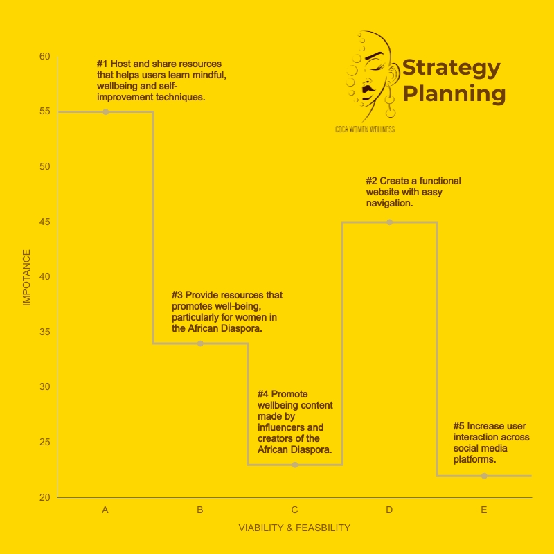
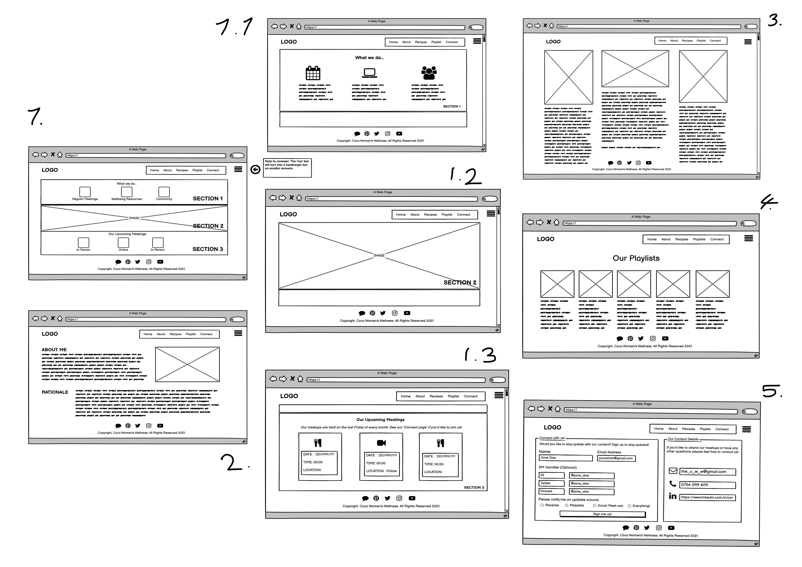
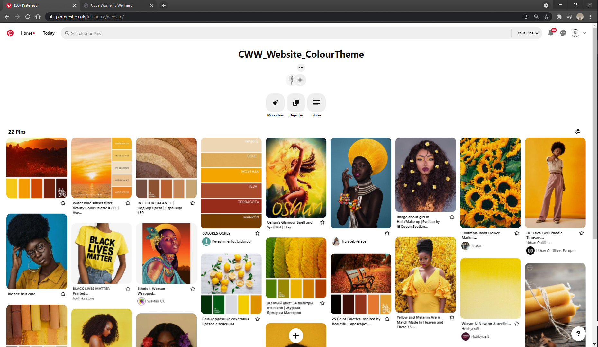
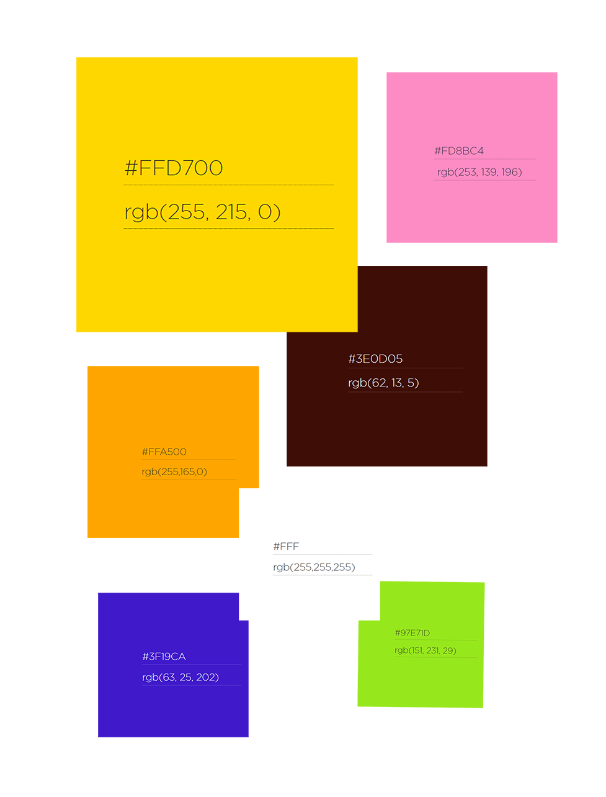
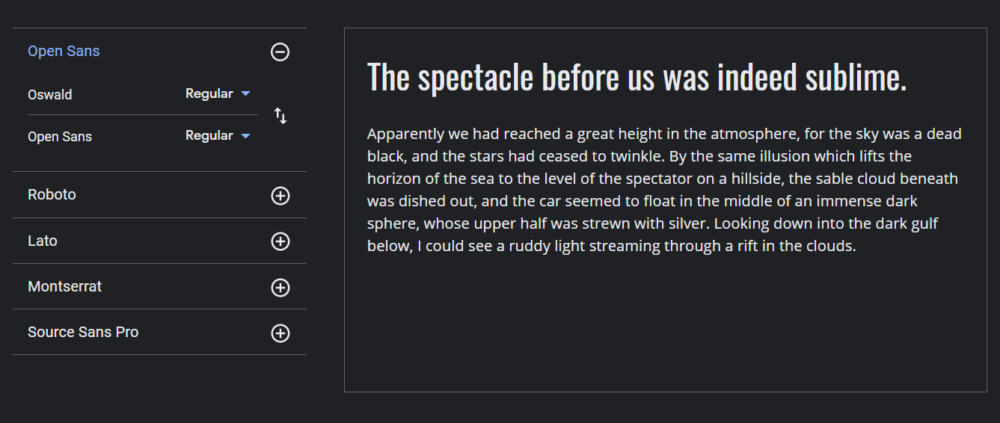

# Coca Women Wellness Website

## Contents
### [1. Overview](##1-Overview)
### [2. User Experience (UX)](##2-User-Experience-UX)
### [3. Content](#3-Content) 
### [4. Features](#4-Features)
### [5. Technologies Used](#5-Technologies-Used)
### [6. Testing](#6-Testing)
### [7. Deployment](#7-Deployment)
### [8. Credits](#8-Credits)
### [9. Acknowledgements](#9-Acknowledgements)
### [10. References](#10-References)

## 1. Overview

- This website is the product of the Portfolio Project 1: HTML & CSS Essentials (a.k.a. Milestone Project 1, MS1). 

- It is part of the Code Institutes’ (CI) Diploma in Full Stack Software Development Diploma (5P).

### 1.1 Chosen Project Idea 
- Out of several ideas presented, Project Idea 0 was chosen as the project asked to ‘…bring your own ideas to life…” through the creation of a website.

- To provide more conceptual structure to the project, the Coca Women Wellness (CWW) website uses the concepts presented in Project Idea Example 3 as a point of reference.  

### 1.2 Project Goals 

## 2. User Experience (UX)

### 2.1 User Stories (Strategy)

#### **2.1.1 Market climate**
Through market research, the following findings supported the conceptualisation of the Coca Women Wellness Website: 

- Due to ongoing sociocultural and social-economic inequality in multiple societies (e.g. COVID-19 and continued social inequality), there has been increased discourse on raising awareness around, and providing greater support for improving people’s wellbeing. 

- Further, there has been an increased volume of socio-economic initiatives that aim to bolster the mental, social, and emotional wellbeing of minority groups, particularly those in the African and/or Caribbean diaspora. 

Considering this, the CWW hosts primary and secondary wellbeing media and resources (e.g. images, videos, tutorials, influencers, and recipes) curated by, and for, communities of the African/Caribbean diaspora. 

#### **2.1.2 Essential Definitions – ‘Mindfulness’ and ‘Wellbeing’**

An essential step in the development of Coca Women Wellness was to understand the semantic meaning and differences between the terms ‘Mindfulness’ and ‘Wellbeing’. 

**Wellbeing**

While the terms _‘wellbeing’_  and  _‘mindfulness’_ are often used interchangeably. It is worth noting that wellbeing is considered a _‘… broad concept…relating to…personal dignity (including treatment of the individual with respect)…, physical and mental health and emotional wellbeing,.. social and economic wellbeing. To summarise, ‘…Wellbeing encompasses several areas of life.'.  As such, it is a growing consensus that _‘…using a holistic approach to ensure a clear understanding of the individual’s views is vital to identifying and defining wellbeing in each case.”_ (Hpft.nhs.uk., 2021).

**Mindfulness**

Similarly, mindfulness is characterised as _“…the practice of maintaining a non-judgmental state of heightened or complete awareness of one's thoughts, emotions, or experiences on a moment-to-moment basis.”_  (Merriam-Webster.com, 2021).

With these definitions in mind, rather than being interchangeable, wellbeing and mindfulness can be regarded as adjoining concepts, where developing mindful practices (in whatever area of life) is likely to positively impact overall wellbeing.

#### **2.1.3 Key Demographic(s)**

‘Demographics’ relates to the characteristics of a population and the specific groups within it. As such, the key demographic factors considered when choosing the target audience of the Coca Women Wellness website were:  

- Sex: Women 
- Age: 16-40
- Ethnicity: African and/or Caribbean heritage 

#### **2.1.4 Psychographics**

‘Psychographics’ refers to the common socio-psychological factors (e.g. motivations, priorities, perspectives etc.) that influences a person’s or groups’, beliefs, expectations, perspectives and hence behaviours.
Prior to creating the website, some market research was conducted to gain insight into the potential psychographic expectations of the target audience. 

The research specifically focused on their expectations when visiting sites that offer content and resources around mindfulness and/or wellbeing. As such, several women were asked the following questions:

1.	Do you visit any wellbeing sites/apps? If so could provide some names?

2.	Do you follow any black female wellbeing influencers?

3.	Do you think wellbeing content created by and for black women would help support your wellbeing?

4.	If you were looking at a wellbeing site designed to promote the wellbeing of black women - what type of content would you like to see? 

5.	How do you prefer wellbeing topics/content to be presented to you (e.g. via blogs, videos, images, courses, or books)?

|Q/User| User ‘R’| User ‘A’| User ‘L’| User ‘AM’| 
|-------------|:-------------:|:-------------:|:-------------:|:-------------
|Q1.|- “…Influencers: **kokobo fitness** - recommended by my sister but I don't know such black influencers myself.”| N/A| “…Emmm I normally go on **skin care** websites. Cleansers/lotions designed for the **black skin**…”|“No I haven’t visited any well-being apps recently.”|
|Q2.|“…Not ones specifically for black woman per se but I use the **Headspace app**.”|N/A|N/A|“Not specifically for well-being no.”|
|Q3.|“…Yeah, BW content could support my wellbeing but I haven't really looked for it.” |“…I think it would be the importance of vulnerability, and black women have it in is too.  I think **self concept** is vital too.” |N/A|“Yes it would be **encouraging** to see **other black women** who are passionate about looking after **their well-being**…”|
|Q4.|N/A|N/A|“… The content I would like to say is **skin care**, brightening creams/lotions. **Products** that make **chocolate skin glow**....**Healthy** vegetarian **meals**… Also more thing Samara, **hair** products for relaxed hair.”|- “I would like to see content relating to **emotional, physical and spiritual well-being**, basically **all aspects of life**”|
|Q5.|N/A|“Blogs and videos.”|N/A|“…books (audio books); videos; vlogs; blogs”|

In extension to the research, the principles outlined in the [‘strategy plane’](https://medium.com/designcentered/ux-design-5-planes-method-b1b1d6587c05#:~:text=The%20five%20planes%20%E2%80%94%20strategy%2C%20scope,the%20problem%20as%20a%20whole.), of the  5 Planes of UX Design model was referred to. This plane assisted in identifying the deliverables of the site. These deliverables were determined and valued by perceived importance, viability, and feasibility. This approached produced the following findings: 

| Opportunities | IMPORTANCE| VIABILITY/FEASIBILITY| 
|-------------|:-------------:|:-------------:|
| (U/SO) a. Host and share resources that helps users learn mindful, wellbeing and self-improvement techniques. |5 | 5 |
| (U/SO) b. Provide resources that promotes wellbeing, particularly for women in the African Diaspora. | 4 |5|
| (U/SO) c. Promote wellbeing content made by influencers and creators of the African Diaspora. | 3 | 2 |
| (U/SO) d. Create a functional website with easy navigation. | 5 | 4 |
|(U/SO) e. Increase user interaction across social media platforms. | 2 | 2 |
|Total| 19 | 16 |

|Key Chart||
|:-------------:|:-------------|
| U | User |
|SO| Site Owner|

#### **2.1.5 User stories – A Summary** 

Based on the interpretations derived from the data, it can be argued that goals of first-time and reoccurring visitors as well as the site owner are as follows: 

**First-time visitor(s) goals**

When visiting the Coca Women Wellness site I want to: 

1. Be introduced to new ways of developing my wellbeing and mindfulness practices.

2. Engage with visual, auditory, and literary content that develops and positively addresses multiple facets of wellbeing.

3. Gain exposure to ‘other’ and new influencers who provide content on multiple topics relevant to promoting my wellbeing. Such facets include, but are not limited to;

    - Meditation practices
    - Platonic, familial, and romantic relationships/social interaction 
    - Hair and Skin care products/practices 
    - ‘Healthy’ food  

4. See the site present content that reflects topics relevant to my ethnicity and cultural background.

**Reoccurring visitor(s) goals**

When visiting the Coca Women Wellness site, I want to:

6. Stay updated on the recent developments of the site through emails and/or newsletters.

7. Engage in the Online and In-person meetups hosted by Coca Women Wellness.

8. Engage with the Coca Women Wellness online community (e.g. via discord and other social media channels).

Additionally, the interpretation of the data charts above the indicated the perceived priorities (goals) for the site owner: 

**Site owner goals**

As a site owner I want to:

9. Host and share resources that helps site visitors learn mindful, wellbeing and self-improvement techniques. 

10. Create a functional website where the user can navigate around easily and access content effortlessly. 

11. Provide resources that promotes wellbeing, particularly for women of the African and Caribbean diaspora.

12. Host and promote wellbeing and mindfulness content, particularly made by influencers of the African and Caribbean diaspora. 

13. Increase user interaction across social media platforms.

### 2.2 Website value (Scope)

The [‘scope plane’]( https://medium.com/designcentered/ux-design-5-planes-method-b1b1d6587c05#:~:text=The%20five%20planes%20%E2%80%94%20strategy%2C%20scope,the%20problem%20as%20a%20whole.), in the 5 Planes of UX Design model suggests that designers should focus on *‘what content may be required to meet users’ needs..’*.  

#### **2.2.1 Valuableness of the website** 

The Coca Women Wellness website provides serves several purposes which increases its value: 

1.  The site intends to bolster users’ wellbeing through exposing them to wellbeing influencers and resources primarily sourced from the African/Caribbean diaspora. 

2. Based on some excerpts from the users’ stories – several women had limited knowledge of wellbeing influencers, specifically those of African and/or Caribbean decent. Lack of exposure of such influencers in media has been a prevalent issue that is being addressed in the current social climate. It has led to the implementation of inclusion and diversity initiatives in media such as [#YouTubeBlack](https://www.youtube.com/intl/ALL_za/creators/ytbvoicesfund/). Coca women wellness attempts to address these issues though the nature of the site’s content. 

3.  The website provides a free, contemporary way of distributing information by presenting non-literary approaches to accessing wellbeing content. 
Mintel reports have indicated that the growth of digital resources and platforms have encouraged people to engage with more visual content, specifically on digital devices like laptops and smartphones (McGrath, 2020).  Moreover, visual content (e.g. films, art, images etc.) has greater engagement from those aged people aged 16-44. Such findings echo trend reports’ assertions that around 26% of UK adults are likely to engage in traditional reading (e.g. hardcover books) (Ryan, 2020). 

As such, the key initiatives of CWW are to: 

- Bolster users’ exposure to digital content and resources that helps develop positive mindfulness practices which will likely promote overall wellbeing. 

- Expose users to influencers that curate content around wellbeing, with the African/Caribbean diaspora in mind.  

#### **2.2.2 Competitors: How does CWW differs competitors?**

To determine the valuableness of the site, it was essential to analyse how the CWW differs from competitor sites. 

Arguably, a lot of wellbeing and mindfulness websites portray a clinical narrative which is often reflected in their content (e.g. aesthetical design) and services (e.g. therapeutic services and treatment). For instance, sites such as [Rethink Mental Illness]( https://www.rethink.org/advice-and-information/living-with-mental-illness/wellbeing-physical-health/black-asian-and-minority-ethnic-mental-health/) offer clinical services such as counselling and priced therapeutic materials (e.g. meditation courses, books). Moreover, a Google search of the phrase ‘black wellbeing’ presented a list of wide range of articles and resources written in extremely formal tones. 

While these resources are appropriate and invaluable to addressing and supporting matters around wellbeing, CWW has been designed with a more informal tone. Specifically, CWW hosts wellbeing resources in an informal relaxed way, reflecting websites such as: 

- [World Changer Life](https://www.worldchangerlife.com/)
- [Kwanda](https://kwanda.co/), 
- [Black Zen](https://www.blackzen.co/#services-and-more) 
- [Black Women Healing Retreats](https://www.blackwomenhealingretreats.com/about-black-women-healing-retreats.html).  

## 3. Content

In line with the [‘structure’ and ‘skeleton’ planes]( https://medium.com/designcentered/ux-design-5-planes-method-b1b1d6587c05#:~:text=The%20five%20planes%20%E2%80%94%20strategy%2C%20scope,the%20problem%20as%20a%20whole.) of the 5 Planes of UX Design model. The producing the initial wireframes were key to the development of the site’s User Interface (UI).  Below are links to serval documents that have supported the conceptualisation and implementation of designing the CWW website. The content in this section includes wireframes, mood boards and colour pallets, font selection and logo design.   

### 3.1. Wireframes (Structure and Skeleton)

The wireframes below depict the **preliminary structure** for the CWW website. These have been grouped by page and device type. 

1.	[Wireframe – HOME]( https://github.com/SOlaCoder005/coca-women-wellness/tree/master/docs/wireframes/home-pages "Wireframes for Home page") 
2.	[Wireframe – ABOUT]( https://github.com/SOlaCoder005/coca-women-wellness/tree/master/docs/wireframes/about-pages  "Wireframes for About page")
3.	[Wireframe – RECIPES]( https://github.com/SOlaCoder005/coca-women-wellness/tree/master/docs/wireframes/recipes-pages   "Wireframes for Recipes page")
4.	[Wireframe – PLAYLISTS]( https://github.com/SOlaCoder005/coca-women-wellness/tree/master/docs/wireframes/playlists-pages "Wireframes for Playlists page")
5.	[Wireframe – CONNECT]( https://github.com/SOlaCoder005/coca-women-wellness/tree/master/docs/wireframes/playlists-pages "Wireframes for Connect page")

 - **PLEASE NOTE:** The structure and appearance of the live deployed CWW website differs considerably from the preliminary wireframes. These differences resulted from responsiveness issues that arose during the initial design of the CWW website. Further information around this has been documented in the [TESTING.md](https://github.com/SOlaCoder005/coca-women-wellness/blob/a5c2068f53f901115928df67ad9651ef0c35415e/docs/testing/TESTING.md) document within this repository’s directory.

Although the final structure of the site differs considerably to the preliminary wireframes; the live deployed CWW has greater responsiveness when accessed by different devices (incl. Desktop, mobile and tablet screens). 

### 3.2 User Experience Design (UXD) elements (Surface)

#### **3.2.1 [Colour Pallet](https://www.pinterest.co.uk/feli_fierce/cww_website_colourtheme/) Rationale** 

Keeping cultural characteristics in mind, a combination of brown and other warm hues were incorporated into the colour scheme CWW. For instance, the conscious decision to apply yellow as the primary colour scheme of the homepage was linked to the strong social-cultural, semantic, and symbolic meaning it conveys within several African/Caribbean communities. 

Many of these cultures have assigned positive connotations to the colour yellow. For instance, concepts around wealth, femininity and fertility in some African cultures are often illustrated with yellow aspects, this can be incorporated into garment colour schemes and even religious characterisations. For instance, the Yoruba Orisha – Oshun has been often been drawn wearing yellow garments (Britannica.com, 2021).  Similarly, within the Caribbean, specifically Rastafarian cultures, the colour yellow has been included in their native attire and artefacts. Yellow in this culture is used to signify wealth and prosperity (BBC.co.uk, 2009).  

The other colours throughout the site were sourced from the images on the left-hand-side of the website’s pages (on desktop screen). Below is a list of the colours, with their respective HEX and RGB values: 

#### **3.2.2 Fonts** 

The fonts used on the CWW site were imported from [Google Fonts](https://fonts.google.com/) and were used on the website for the following reasons: 

1. **Oswald**: This is a considerably ‘weighted’ sans-serif font. It was used on the header sections to ensure that the navigation titles remained prominent across the varying header colours.

2. **Open Sans**: Aside from the header, this font was used throughout the site. It was chosen to compliment the ‘feminine’ theme of the site. Arguably, round shapes are often associated with feminine characteristics. As such, the rounded characteristics of this font conveys a softer tone to the overall page compared to the Oswald font and vibrant colours used. 

## 5. Technologies Used

Below are a list of all the technologies, languages and tools that has aided the construction of the Coca Women Website.

#### 5.1 Languages

- **HTML** – Supported the core structure of the website.
- **CSS** – Supported the styling elements on the website.
- **JavaScript** - Supported specific functionalities within the site (e.g. the navigation bar on the website)
- **JQuery** – Supported specific functionalities (e.g. the scroll features on the website) within the site through simplifying ‘Document Object Model’ (DOM) manipulation (Developer.mozilla.org, 2021). 

#### 5.2 Libraries, Resources and Tools

-	[Adobe Creative Cloud](https://www.adobe.com/uk/creativecloud.html): Specifically, I used the applications - Illustrator (AI), Photoshop (PS) and InDesign (InD) to create the website log. In more detail AI was used to create the design (from my hand drawing), PS used to help design my logo for the website and also select specific colour values that form the colour scheme of the website. Lastly, InD was used to apply and align the ‘Coca Women Wellness’ name to the logo once it was created in AI. 
-   [Balsamiq]( https://balsamiq.com/): An application that allows designers sketch up User Interfaces (UI)
-	[Bootstrap](https://getbootstrap.com/): Provided useful components that assisted my site’s functionality (e.g. responsive navigation menu).
-	[Cite This for Me](https://www.citethisforme.com/): This was primarily used to cite the websites and resources I referred to help build the site. 
-   [Dillinger](https://dillinger.io/): An extremely useful markdown complier tool that allows you to check your code is formatted correctly on the README.md file.
-   [Font Awesome](https://fontawesome.com/) - While the site hosts a number of resources, most of the icons used on the live site has been sourced from Font Awesome.
-	[GitHub](https://github.com/): A version control software that can has both desktop and online platforms. 
-   [GitPod](https://www.gitpod.io/): An IDE that can be used online and locally on your desktop.
-	[Google Drive](https://drive.google.com/): This was mainly used to backup my repo once saved to my local drive.
-   [Google Fonts](https://fonts.google.com/): This platform was used to select and import the desired font into my source code.
-   [(Jigsaw) Validator](https://jigsaw.w3.org/css-validator/): This has been used to check the quality of my CSS code and ensures it passes coding standards.
-   [Lighthouse](https://developers.google.com/web/tools/lighthouse): Provides analytical reports on the degree to which a site is responsive. 
-   [nekoCalc](https://nekocalc.com/px-to-rem-converter): An online application that converts px to rem. 
-   [Pexels](https://www.pexels.com/): Aside from the CWW logo, some of the photos included on the live website has been sourced from Pexels. Pexels provides royalty-free stock images. 
-   [Pixabay](https://pixabay.com/): Aside from the CWW logo, some of the photos included on the live website has been sourced from Pixabay. Pexels provides royalty-free stock images. 
-   [Pinterest](https://www.pinterest.co.uk/feli_fierce/cww_website_colourtheme/): An application where I collated visuals for my mood board for the website’s colour schemes (include live link to board).
-   [Responsively](https://responsively.app/download): Web Browser that allows you to check the degree to which you website is responsive on various device sizes and screen orientations.
-   [Stack Overflow](https://stackoverflow.com/): This was used as a reference tool to assist with both HTML coding techniques.
- [VSCode](https://code.visualstudio.com/): An open source IDE that can be used online and locally on your desktop.
- [Visme](https://www.visme.co/): An online application that assist with building visual content (e.g. graphs and charts) for business purposes. 
-   [Wave]( https://wave.webaim.org/): A ‘Web Accessibility Evaluation Tool’ that determines the extent to which a site is accessible. 
-   [W3C Validator](https://validator.w3.org/): This has been used to check the quality of my HTML code and ensures it passes coding standards.
-   [W3 Schools](https://www.w3schools.com/): This was used as a reference tool to assist with HTML coding techniques. 
-   [W3.CSS](https://www.w3schools.com/w3css/default.asp): This was used as a reference tool to assist with CSS coding techniques.
-   [Youtube](https://www.youtube.com/): Referred to for useful coding and UXD tips and tutorials.
